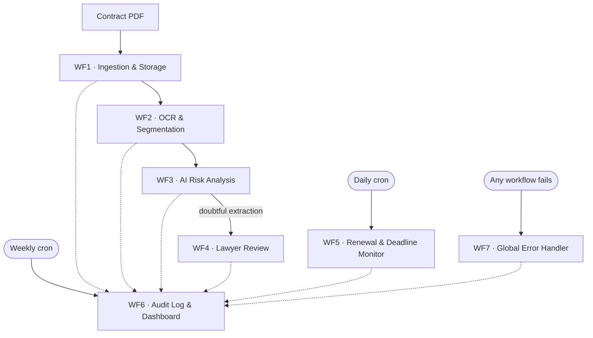

# AI Legal Document Review & Compliance Platform

An n8n automation platform that reads a commercial contract PDF, extracts five
specific clause types with an LLM, scores each extraction for risk, routes
doubtful extractions to a human lawyer, tracks review deadlines on a daily cron,
and writes every step to an append-only audit trail.

Seven independent workflows, ~65 nodes, backed by PostgreSQL (Supabase) and
`gpt-4o-mini` with JSON-Schema structured output.

**What makes this different from a demo:** the extraction quality is *measured*.
Every clause the system pulls out is scored against expert lawyer annotations
from the CUAD dataset, using SQuAD-style token F1. The numbers below are real,
reproducible from this repo, and include the cases where the system got it wrong.

---

## Evaluation results

Measured on the **dev split**: 17 ingested contracts, 85 contract×clause-type
pairs, 115 predicted spans. Scored by `scripts/evaluate.py` against 260
lawyer-annotated gold spans from CUAD.

| Metric | Value |
|---|---|
| Detection recall | **83.5%** (71 / 85 pairs found) |
| Span precision | **70.4%** (81 / 115 spans correct) |
| Mean best token F1 | 0.799 |
| Mean gold containment | 0.762 |

Per clause type:

| Clause type | Pairs | Recall | Span precision | Mean F1 |
|---|---:|---:|---:|---:|
| Anti-Assignment | 17 | 94.1% | 84.0% | 0.957 |
| Governing Law | 17 | 88.2% | 69.6% | 0.871 |
| Termination For Convenience | 17 | 88.2% | 55.6% | 0.788 |
| Renewal Term | 17 | 82.4% | 70.8% | 0.799 |
| Cap On Liability | 17 | 64.7% | 75.0% | 0.578 |

**Cap On Liability is the weakest clause type** and is the obvious first target
if prompt work resumes.

### How to read these numbers

- **Detection recall** — of the 85 pairs where a lawyer confirmed the clause
  exists, how many did the system produce at least one correct span for?
- **Span precision** — of the 115 spans the system asserted, how many matched
  the lawyer-annotated text? A span naming the right clause type but quoting the
  wrong paragraph counts against it. This is *not* document-level precision.
- **Matching** is SQuAD-style token F1 on normalised text at threshold 0.50, not
  character offsets. A prediction matching *any* of the gold spans for that pair
  counts as correct — CUAD supplies up to 7 spans per pair.

### What this evaluation cannot tell you

Three limits, stated plainly because a metric without its caveats is marketing:

1. **There are no true negatives.** `prepare_dataset.py` selected contracts that
   contain all five clause types, so all 150 gold pairs are present and
   `gold_labels` holds zero `is_absent = true` rows. This evaluation therefore
   **cannot** measure clauses hallucinated where none exist, and does not claim to.
2. **The 9 pairs where the system asserted absence are false negatives by
   construction** (14 spans). Since no clause is genuinely absent, every assertion
   of absence is wrong.
3. **15 pairs were skipped** — 3 of the 20 dev contracts are in `gold_labels` but
   were never ingested, so there was nothing to score.

The 10-contract **holdout split has never been opened** and is not scored here.
Holdout evaluation is blocked on a known ingestion issue — see
[Known limitations](#known-limitations).

Regenerate these numbers:

```powershell
python scripts/evaluate.py --split dev
```

Full output, including the confidence and attribution breakdowns, is written to
`docs/evaluation.md`.

---

## Architecture

Seven workflows. Four form a sequential extraction pipeline; three run
cross-cutting, on their own triggers.



Solid arrows are the data path. Dotted arrows are audit writes — every workflow
reports to WF6, and none of them wait for it.

| # | Workflow | Trigger | Does |
|---|---|---|---|
| 1 | Ingestion & Storage | Webhook | Hashes the file, dedups on `file_hash`, stores the document row, calls WF2 |
| 2 | OCR & Segmentation | Called by WF1 | Extracts the text layer, cleans it, splits it into segments, calls WF3 |
| 3 | AI Risk Analysis | Called by WF2 | Sends segments to `gpt-4o-mini` with a JSON Schema, validates the response, scores risk and confidence, routes doubtful extractions to WF4 |
| 4 | Lawyer Review & Approval | Called by WF3 | Queues a review request, waits on a form webhook, applies approve / correct / reject, and appends lawyer corrections to `gold_labels` |
| 5 | Renewal & Deadline Monitor | Daily schedule | Finds review deadlines inside the 30 / 14 / 7-day windows and queues reminders |
| 6 | Audit Log & Dashboard | Called by all + weekly schedule | Appends to `audit_log`; on Mondays aggregates the week and queues a digest |
| 7 | Global Error Handler | Error Trigger | Classifies the failure, decides retryable vs fatal, queues an alert |

### Three things worth noticing in this diagram

**WF6 is called by everything, and blocks nothing.** Every `Call WF6` node runs
with *Wait For Sub-Workflow* OFF and *On Error → Continue*. A failed audit write
must never kill an ingestion.

**WF7 is registered, not wired.** WF1–WF6 each name WF7 as their Error Workflow
in workflow settings, so a failure anywhere fires it automatically — there is no
error branch drawn on any canvas. WF7's own Error Workflow is deliberately blank;
self-reference would loop.

**WF5 monitors review deadlines, not contract renewal dates.** The reason is in
[Design rationale](#design-rationale).

### Email

No mail credential is configured. Every workflow that would send email instead
writes a row to `email_outbox` with a `purpose`
(`clause_review`, `renewal_reminder`, `weekly_digest`, `error_alert`) and
`status = 'queued'`. Attaching a real mail node is a one-node change per
workflow; the queue table stays useful either way as a delivery log.

### Database

PostgreSQL (Supabase). Nine tables:

| Table | Holds |
|---|---|
| `documents` | One row per contract. `file_hash` UNIQUE is the dedup mechanism |
| `document_versions` | Re-uploads of the same contract over time |
| `document_segments` | The cleaned, split text WF3 reads from |
| `clauses` | One row per extracted clause. `extracted_fields` is JSONB |
| `obligations` | Dated commitments, feeding WF5 |
| `review_requests` | Open and decided lawyer reviews |
| `email_outbox` | Queued notifications, all purposes |
| `audit_log` | Append-only trail. Every workflow writes here via WF6 |
| `gold_labels` | CUAD expert answers, plus lawyer corrections from WF4 |

Row-level security is off — see [Design rationale](#design-rationale).

---

## Design rationale

The decisions below are the ones a reviewer is most likely to question. Each is
stated with the reason, and where a measurement contradicted an earlier
assumption, the measurement wins.

### Why there is no RAG in the extraction path

Chunking and retrieval are different things, and conflating them would break this
system.

Chunking splits a long document so it fits the model's context window — **every
chunk gets processed.** RAG retrieves only the chunks most similar to a query and
discards the rest. For extraction from a *known* document, discarding is exactly
the wrong behaviour: a governing-law clause phrased unusually would rank low on
similarity and be silently dropped. The system would report absence, and the
absence would look identical to a genuine one.

Extraction needs 100% document coverage. So the pipeline chunks and processes
everything.

Vector search is appropriate for the optional precedent-comparison feature —
"find similar clauses across other contracts" — where the retrieval problem is
real and a miss is a weaker answer rather than a false negative. That feature is
not built.

### Why extraction quality is measured against attribution, not self-report

The model returns a confidence score with every extraction. It also returns an
`attribution` field describing how it produced the span: `model` (generated),
`recovered` (matched back to source text), `not_found` (could not locate the text
it claimed), `spanning`.

Roughly **20% of extractions are paraphrase despite an explicit verbatim
instruction.** The prompt asks for text copied exactly from the contract; the
model sometimes summarises instead, and occasionally does something stranger. One
real row in the database — clause id 38 — has `clause_text` set to:

> `required — paste the true clause text, copied verbatim from the contract`

The model echoed the schema's own field description back as the answer. It was
flagged: `attribution: not_found`, `verbatim_ok: false`.

This is why `not_found` matters. It is not a confidence signal — it is a
*verification* signal. The pipeline takes the text the model returned and tries to
find it in the source document. If it cannot, the extraction is marked
`not_found` regardless of how confident the model claimed to be. Paraphrase is
detectable this way; it is not detectable from a confidence number.

### Why review routing needed rethinking — and what the data said

The original design routed human review on evidence (`attribution` and
`is_absent` + risk score), on the stated grounds that **confidence carried no
signal** — it clustered in a narrow high band and did not separate good
extractions from bad.

**The evaluation contradicts half of that.**

Match rate by confidence band, across 115 scored spans:

| Confidence | Spans | Match rate |
|---|---:|---:|
| 0.50 – 0.69 | 5 | 0.0% |
| 0.70 – 0.84 | 12 | 8.3% |
| 0.85 – 1.00 | 98 | 81.6% |

Match rate by attribution:

| Attribution | Spans | Match rate |
|---|---:|---:|
| `spanning` | 1 | 100.0% |
| `model` | 67 | 77.6% |
| `recovered` | 23 | 73.9% |
| `not_found` | 24 | 45.8% |
| `is_absent = true` | 14 | 0.0% |

Of the 34 wrong spans:

- **Low confidence (< 0.85) flags 17 spans and catches 16 of the 34 errors.**
  High precision, very few false alarms.
- **`not_found` flags 24 spans and catches roughly 13.** Flags more, catches
  fewer — but catches a partly *different* set.

**Neither signal alone is sufficient.** Low confidence is a high-precision,
low-recall failure flag; `not_found` catches an overlapping but distinct set.
Routing on both catches more than either alone. High confidence, meanwhile, is
genuinely uninformative — 98 of 115 spans sit in the top band and 18 of those are
still wrong — which is why confidence alone cannot *clear* a span for
auto-approval.

The original claim that confidence carries no signal was wrong in one direction
and right in the other: it cannot clear a span, but low confidence turned out to
be the best single failure flag available.

> **Current state:** WF4 routes on evidence only
> (`attribution = 'not_found'`, or `is_absent` with `risk_score >= 0.60`).
> Adding the low-confidence condition is justified by the table above and is a
> pending change, not a shipped one.

### Why WF5 monitors review deadlines, not contract renewal dates

Contract renewal dates come from the extraction layer — they are exactly the
output whose accuracy this project set out to measure, and that accuracy is 83.5%
recall. Firing legal deadline reminders off an 83.5%-accurate date field would
mean silently missing roughly one renewal in six, with no way for the recipient
to know a reminder was owed.

Review deadlines are different: they are generated by the system itself when a
review request is created, so they are correct by construction. WF5 therefore
monitors what it knows to be true. Renewal monitoring becomes appropriate once
the extraction numbers justify it — and the evaluation harness is how that call
gets made.

### Why environment variables became a config node

The platform this runs on blocks `$env` at run time (`access to env vars
denied`), and `$vars` is an Enterprise-tier feature. Neither is available.

Every workflow that needs configuration therefore starts with a
`Config - ...` Set node, read downstream as
`$('Config - Alert Settings').first().json.someKey`. Code nodes that consume
config check `$vars` first and fall back to the config node, so the same
workflow JSON still runs unmodified on a self-hosted instance where `$vars`
works.

The trade-off is honest: configuration is now visible inside the workflow JSON
rather than injected at deploy time. Nothing secret lives there — credentials
remain n8n Credential entries and are never pasted into nodes.

### Why audit logging never blocks its caller

Every `Call WF6` node runs with **Wait For Sub-Workflow OFF** and
**On Error → Continue**. If the audit write fails, the calling workflow carries
on.

This is deliberate. Logging is observability, not business logic. An ingestion
that succeeded but whose audit row failed to write is a monitoring gap; an
ingestion killed *because* its audit row failed is a lost contract. The second
failure is strictly worse than the first.

### Why `audit_log` has no `ON CONFLICT` clause

Everywhere else in this project, inserts are made idempotent — `email_outbox`
dedups by subject within the day, `gold_labels` uses `ON CONFLICT DO NOTHING`,
`documents` dedups on `file_hash`. `audit_log` deliberately does not.

An audit trail records what happened. If the same event genuinely fired twice,
two rows is the truth. A swallowed duplicate is a hole in the trail, and a trail
with holes cannot be used to reconstruct an incident. Duplicate audit rows are
noisy; missing ones are dishonest.

### Why `audit_log.document_id` is not a foreign key

Every other `document_id` column in the schema is a real FK with
`ON DELETE CASCADE`. `audit_log.document_id` is a bare `BIGINT`.

Audit records must survive the deletion of the thing they describe. If deleting a
document erased its audit history, the trail could be cleaned by deleting the
evidence — which is the one thing an audit trail exists to prevent.

This has a downstream consequence worth knowing: WF7 passes `document_id = 0`
to WF6 when an error has no associated document, and `Normalise Audit Event`
converts it to NULL. The same trick is *not* used for `email_outbox`, whose
`document_id` **is** a real FK — inserting `0` there would violate it, so the
column is omitted from the insert and lands NULL naturally.

### Why row-level security is off

Supabase enables RLS by default. It is off on every table here.

n8n is the sole database client. There is no browser-side access, no per-user
session, and no multi-tenancy — one service, one connection, one set of
credentials. RLS in that setting adds policy surface without adding a boundary,
because there is no second party to be isolated from.

This would have to change the moment a second client touches the database
directly.

### Why evaluation matches on text, not character offsets

`gold_labels.answer_start` and `clauses.char_start` both look like character
offsets into the contract. They are not comparable.

CUAD's offsets index into CUAD's own text extraction of the PDF. This pipeline's
offsets index into this pipeline's extraction. Different extractors handle
whitespace, ligatures, headers and page breaks differently, so the same clause
sits at a different offset in each. Comparing them would produce failures that
measure PDF parsing, not clause extraction.

Matching is therefore SQuAD-style token F1 on normalised text at threshold 0.50 —
the same metric family CUAD itself is scored with. A prediction counts as correct
if it matches *any* gold span for that pair, since CUAD supplies up to 7 spans
per pair and any of them is a valid answer. Where a pair produced multiple
predicted spans, the best-scoring one is taken.

### Why the evaluation has no true negatives

`prepare_dataset.py` selects contracts containing **all five** clause types, so
that every contract exercises every extractor. The side effect is that
`gold_labels` contains zero `is_absent = true` rows.

The consequence is stated at the top of this file and repeated here because it
bounds every number in it: this evaluation measures whether the system finds
clauses that exist. It **cannot** measure whether the system invents clauses that
do not. Testing that would require deliberately selecting contracts missing a
clause type — a different sampling strategy, and a worthwhile extension.

---

## Setup

> **Read [Known limitations](#known-limitations) before starting.** The ingestion
> path (WF1 → WF2) currently cannot run on managed n8n Cloud, because both
> workflows read and write a local filesystem path that does not exist there.
> A self-hosted instance started from the included `docker-compose.yml` does not
> have this problem. Setup below covers both; the difference is called out where
> it matters.

### 1. Clone and install

```powershell
git clone https://github.com/<your-account>/ai-legal-document-review-platform.git
cd ai-legal-document-review-platform
python -m venv .venv
.\.venv\Scripts\Activate.ps1
pip install -r requirements.txt
```

### 2. Configure environment

Copy `.env.example` to `.env` and fill in real values.

```powershell
Copy-Item .env.example .env
```

| Key | Used by | Notes |
|---|---|---|
| `DATABASE_URL` | Python scripts | Postgres connection string. Supabase: use the **session pooler** host |
| `OPENAI_API_KEY` | WF3 (via n8n credential) | Also read by scripts if extraction is run outside n8n |
| `REVIEW_EMAIL` | WF4, WF7 | Address review requests and error alerts are addressed to |
| `WEBHOOK_URL` | `scripts/post_contract.py` | Base URL of the n8n instance, e.g. `http://localhost:5678` |
| `N8N_ENCRYPTION_KEY` | `docker-compose.yml` | Self-hosted only. Set it explicitly, or rebuilding the container makes every saved credential unreadable |
| `GENERIC_TIMEZONE` | `docker-compose.yml` | Self-hosted only. `Asia/Kolkata` here |

`.env` is gitignored. `.env.example` carries the key names with placeholder
values and is safe to commit.

### 3. Create the database

Run the files in `sql/` **in numerical order**, 001 through 007, in the Supabase
SQL Editor or any Postgres client.

```
001_schema.sql → 002 → 003 → 004 → 005 → 006 → 007
```

Every migration is written with `IF NOT EXISTS`, so re-running is safe.

**Do not run `sql/reset_wf5_demo.sql`.** It is deliberately unnumbered because it
is not a migration — it clears WF5 state so a demo can be replayed, and it
deletes rows.

Verify the connection:

```powershell
python scripts/test_connection.py
```

### 4. Prepare the dataset

Download CUAD (see [Dataset and licence](#dataset-and-licence)) into `data/raw/`,
then:

```powershell
python scripts/inspect_cuad.py        # lists the 41 categories with counts
python scripts/prepare_dataset.py     # selects 30 contracts, splits dev/holdout
python scripts/load_gold_labels.py    # loads gold spans into Postgres
```

`prepare_dataset.py` sorts alphabetically rather than sampling randomly, so the
split is reproducible on any machine. `load_gold_labels.py` uses
`ON CONFLICT DO NOTHING` and can be re-run without duplicating rows.

**`data/prepared/holdout/` holds 10 sealed contracts. Do not open them.** They
exist to produce one final unbiased number. Any prompt tuned against them makes
that number self-graded and worthless.

### 5. Start n8n

**Self-hosted (recommended — this is the only configuration where the full
pipeline runs):**

```powershell
docker compose up -d
```

Then open `http://localhost:5678`.

**Managed n8n Cloud:** create an account and skip this step. Note that
`docker-compose.yml`'s filesystem mounts and environment variables have no
equivalent on Cloud — see [Known limitations](#known-limitations).

### 6. Import workflows

Import each JSON file from `workflows/` into n8n. Then, for each workflow:

1. **Set the timezone.** Canvas → ⋯ → Settings → Timezone → `Asia/Kolkata`.
   Timezone inheritance is unreliable on Cloud; set it explicitly on all seven or
   the daily and weekly crons fire at the wrong hour.
2. **Register the error handler.** Canvas → ⋯ → Settings → Error Workflow →
   `WF7 - Global Error Handler`, on **WF1 through WF6**.
   **Leave WF7's own Error Workflow blank** — self-reference loops.
3. **Publish bottom-up: WF7, WF6, WF5, WF4, WF3, WF2, WF1.** A workflow cannot
   be published while a sub-workflow it calls is still unpublished.

> Changing any workflow setting reverts a published workflow to draft. Publish
> again after every settings change, or the live version still has no error
> handler attached.

### 7. Create credentials

Two n8n Credential entries, created in the n8n UI:

| Credential | Type | Notes |
|---|---|---|
| `Supabase Postgres - Assign11` | Postgres | Session pooler host, port 5432, **Ignore SSL Issues ON** |
| `OpenAI - Assign11` | OpenAI | Model used is `gpt-4o-mini` |

Credentials are never pasted into node fields. If the imported nodes show a
missing-credential warning, select these entries from the dropdown.

---

## Running it

### Ingest a contract

```powershell
python scripts/post_contract.py --index 0
```

Posts one prepared dev PDF to WF1's webhook. Use the script rather than `curl` —
Windows PowerShell 5.1 cannot escape CUAD's filenames correctly.

WF1 hashes the file and checks `documents.file_hash`. A file already ingested
takes the "already seen" branch and does not re-run the pipeline.

**Done when:** a new row appears in `documents`, and within a minute or two,
rows appear in `document_segments` and then `clauses`.

### Score the extractions

```powershell
python scripts/evaluate.py --split dev
```

| Flag | Effect |
|---|---|
| `--split dev` \| `holdout` | Which split to score. Default `dev` |
| `--threshold 0.50` | Token-F1 cutoff for counting a span correct |
| `--show-misses N` | Print N failed pairs with their text. **Refused for holdout** |
| `--no-report` | Skip writing `docs/evaluation.md` |

`--show-misses` is refused on the holdout split by design, so the final holdout
numbers can be produced without ever printing holdout text to a terminal.

Only `gold_labels` rows with `source = 'cuad'` are scored. Lawyer corrections
appended by WF4 carry `source = 'lawyer_review'` and are excluded — scoring the
system against corrections it produced would be circular.

### Watch the background workflows

- **WF5** runs daily and queues `renewal_reminder` rows in `email_outbox`.
- **WF6** runs Mondays and queues one `weekly_digest` row.
- **WF7** fires automatically when any of WF1–WF6 fails, and queues an
  `error_alert` row.

Nothing is emailed. Inspect the queue:

```sql
SELECT purpose, subject, status, created_at
FROM email_outbox
ORDER BY created_at DESC;
```

WF4's review flow is idempotent by design and will refuse to re-create a request
that is already pending. To replay it during testing:

```sql
UPDATE review_requests
SET status = 'cancelled', decided_at = NOW()
WHERE status = 'pending';
```

---

## Known limitations

### Ingestion does not run on managed n8n Cloud

**This is the significant one.** WF1's `Save PDF` node writes to
`/files/ingested`, and WF2's `Read PDF` node reads from it. Both paths come from
volume mounts declared in `docker-compose.yml`. Managed n8n Cloud has no
filesystem mounts, so neither path exists and the handoff between WF1 and WF2
breaks. `scripts/post_contract.py` also targets `http://localhost:5678` by
default.

**Consequence:** on Cloud, no new contract can be ingested. The 17 documents
already in the database were ingested on the self-hosted instance and remain
scoreable, but the pipeline cannot be demonstrated end-to-end there, and the
holdout split cannot be ingested — so the final holdout evaluation has not been
run.

The fix is to replace the filesystem handoff with Google Drive nodes or to pass
the PDF as base64 through the webhook. Neither is implemented.

**On self-hosted n8n started from the included `docker-compose.yml`, this
limitation does not apply.**

### Scope locks

These were decided deliberately and are not oversights:

| Locked | Reason |
|---|---|
| Digital-native PDFs only (text layer present) | OCR is a large time sink and orthogonal to the extraction problem being measured |
| Scanned documents out of scope | Same. No OCR-unavailable detection branch exists yet either |
| Exactly 5 clause types | Small enough to evaluate properly against gold labels |
| CUAD corpus only | Real contracts with free expert annotation |
| English only | Avoids multilingual complexity |
| No RAG in extraction | See [Design rationale](#design-rationale) |

### Smaller gaps

- **No true negatives in the evaluation.** Covered above; it bounds every number
  in this file.
- **The WF3 extraction prompt is not version-controlled.** It lives only inside
  the n8n node, so it ships with the workflow JSON but is not diffable and has no
  history. The most important single piece of logic in the project is the one
  piece not tracked as a file.
- **`workflows/sql/` covers WF4–WF6 only.** WF1–WF3 and WF7 Postgres queries
  exist only inside the exported JSON.
- **Low confidence is not yet part of WF4's routing** despite the evaluation
  justifying it. See [Design rationale](#design-rationale).
- **WF3 has no retry-with-backoff on the OpenAI node,** and does not advance
  `documents.status` to `'analyzed'` on completion.
- **No mail credential.** All notifications queue in `email_outbox` rather than
  sending.
- **RLS is off on all tables.** Deliberate and single-tenant; see
  [Design rationale](#design-rationale).
- **`document_versions` exists but nothing writes to it.** Re-upload version
  tracking is designed but not built.

---

## Repo layout

```
.
├── README.md
├── .env.example              key names with placeholder values
├── requirements.txt
├── docker-compose.yml        self-hosted n8n (see Setup)
│
├── data/                     not committed
│   ├── raw/                  CUAD_v1.json + source PDFs
│   └── prepared/
│       ├── dev/              20 contracts
│       ├── holdout/          10 contracts — sealed
│       └── gold_labels.json
│
├── scripts/
│   ├── inspect_cuad.py       list CUAD clause categories and counts
│   ├── prepare_dataset.py    select 30 contracts, split dev/holdout, copy PDFs
│   ├── load_gold_labels.py   load gold spans into Postgres (idempotent)
│   ├── post_contract.py      post one prepared PDF to the WF1 webhook
│   ├── test_connection.py    verify DATABASE_URL reaches Supabase
│   └── evaluate.py           score clauses against gold_labels
│
├── sql/                      numbered migrations, applied in order
│   ├── 001_schema.sql              base tables and indexes
│   ├── 002_wf2_segments.sql        document_segments
│   ├── 003_wf3_extraction.sql      clause extraction fields
│   ├── 004_wf4_review.sql          review_requests
│   ├── 005_wf4_email_outbox.sql    email_outbox
│   ├── 006_wf5_obligations_seed.sql
│   ├── 007_email_outbox_obligation_link.sql
│   └── reset_wf5_demo.sql    demo reset helper — unnumbered, NOT a migration
│
├── workflows/                exported n8n workflow JSON
│   ├── wf1_ingestion.json … wf7_global_error_handler.json
│   ├── code/                 Code node JavaScript, one file per node
│   └── sql/                  readable copies of selected Postgres node queries
│                             (WF4–WF6; WF1–WF3 and WF7 live only in the JSON)
│
└── docs/
    └── evaluation.md         generated by scripts/evaluate.py
```

`workflows/code/` and `workflows/sql/` exist so that logic living inside n8n
nodes is still reviewable without opening the editor. The n8n JSON export is the
source of truth for the workflows themselves; those two folders are readable
copies, and `workflows/sql/` currently covers WF4–WF6 only.

---

## Dataset and licence

Extraction quality is measured against **CUAD** — the Contract Understanding
Atticus Dataset, from The Atticus Project.

- **Source:** https://www.atticusprojectai.org/cuad
- **Licence:** CC BY 4.0 — free for commercial and non-commercial use
- **Contents:** 510 real commercial contracts from SEC EDGAR, with 13,000+ clause
  annotations across 41 categories, labelled under the supervision of experienced
  lawyers

Two files are used: `CUAD_v1.json` (the annotations, in SQuAD format — each
contract has a `context` and 41 question-answer pairs) and the source PDFs under
`full_contract_pdf/`.

CUAD is **not committed to this repository.** `data/` is gitignored; the corpus is
several gigabytes. Download it from the link above into `data/raw/` before running
`prepare_dataset.py`.

30 contracts are selected: 20 for development, 10 sealed as holdout.

If you use CUAD, cite it:

> Hendrycks, D., Burns, C., Chen, A., & Ball, S. (2021).
> *CUAD: An Expert-Annotated NLP Dataset for Legal Contract Review.*
> NeurIPS Datasets and Benchmarks Track.
